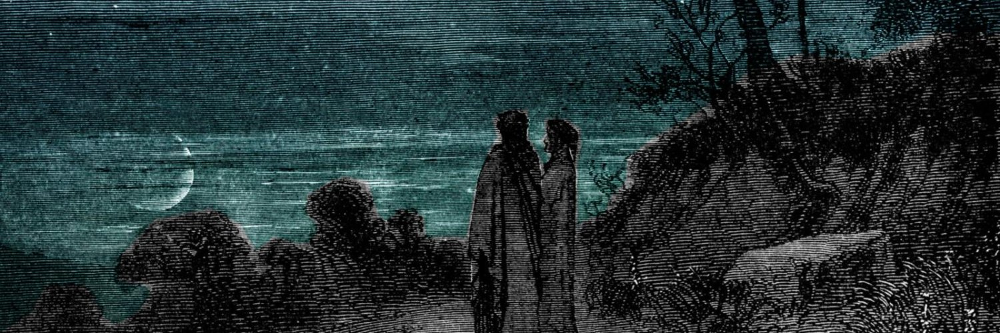

  

 

  <h1 style="font-size: 2.5rem; font-weight: 700; margin-bottom: 0.5rem; letter-spacing: -0.02em;">Dove</h1>
  

    Data Scientist & Machine Learning Researcher
  

  

    Building intelligent pipelines in <b>NLP</b>, <b>Bioacoustics</b>, and <b>Computer Vision</b>. My approach bridges the gap between academic theory and scalable, real-world AI solutions.
  

 

## 🛠️ Tech Stack & Skills

**Languages**

    

**Machine Learning**

   

**Deep Learning**

  

**NLP & Audio**

    

**Computer Vision**

 

**Tools & Visualization**

    

 

## 🎓 University Thesis

**Project:** *Automatic Ticket Classification via TF-IDF & SVM*

My graduation thesis focuses on creating a robust NLP pipeline for automated helpdesk triage, prioritizing **Data-Centric AI** principles.

*   **Key Contribution:** Demonstrated that refining data quality (through noise injection and semantic perturbation) often yields higher performance gains than traditional hyperparameter tuning.
*   **Core Concepts:** SVMs, High-dimensional Vector Spaces, Primal-Dual formulation, Soft-margin optimization.
*   **Repository:** Explore the implementation here: [PW_Triage_ML](https://github.com/cestdove/PW_Triage_ML).

 

## 🚀 Projects & Roadmap

**What I've done**

🪶 **[BioAcoustic-Vector-Search](https://github.com/cestdove/BioAcoustic-Vector-Search)** — Bioacoustic search engine for bird species identification using MFCC extraction (Librosa), similarity search (ChromaDB), and Streamlit.

🎫 **[PW_Triage_ML](https://github.com/cestdove/PW_Triage_ML)** — Modular text classification pipeline implementing SVMs with explainability dashboards for feature importance analysis.

**What I'm aiming for next**

- Expand into **Computer Vision** by integrating neural architectures (PyTorch / Keras) with traditional machine learning.
- Build end-to-end vision pipelines for complex visual data analysis.
- Advance research in signal processing and deep learning applications.

 

## 📊 GitHub Stats

 

